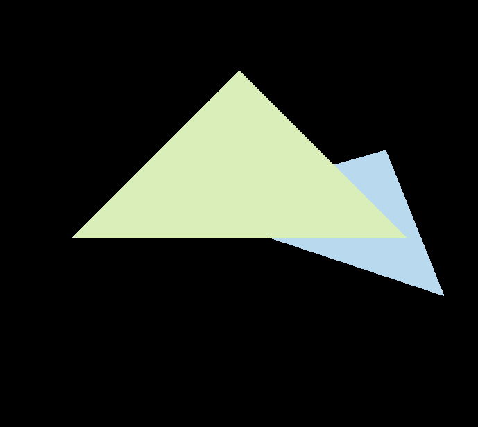
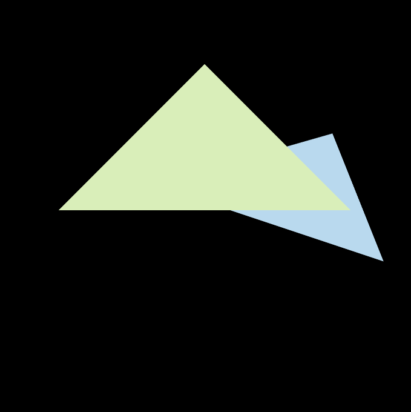

Implementation：

- rasterization with bounding box

- check if any point is inside the triangle（change the first two params. as float）
- z-buffer
- MSAA 

> Note/Question: to eliminate the abnormal black line inside the intersection btw two triangles, it seems that we need to keep updating an extra color buffer in order to procure the final avg. color of the mixed green and blue color rather than rendering them sequentially. Otherwise it seems unlikely to cut it off. 