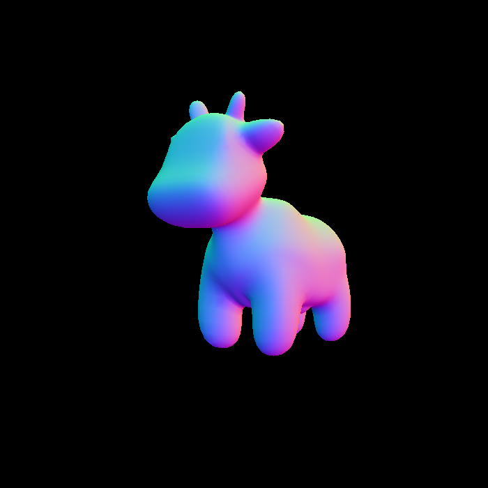
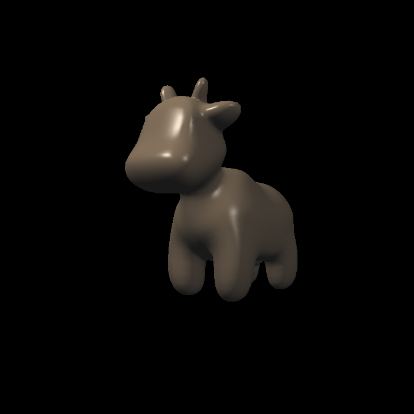
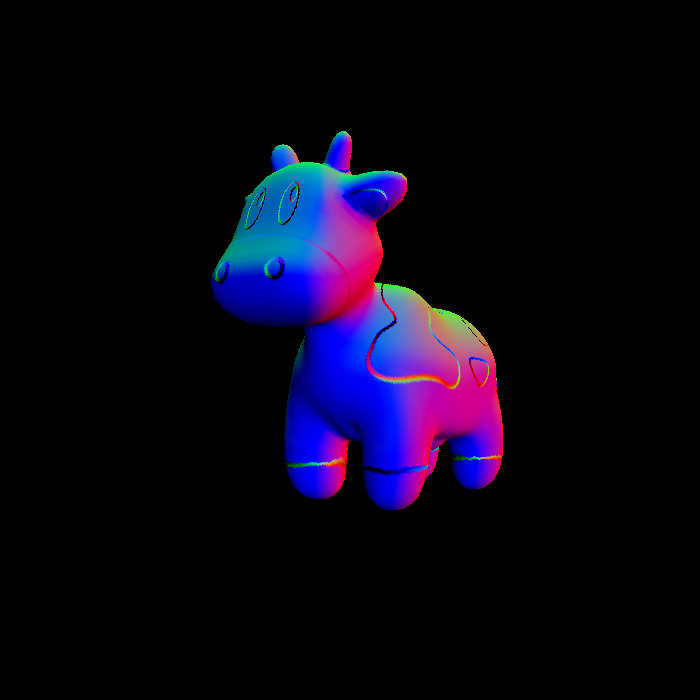
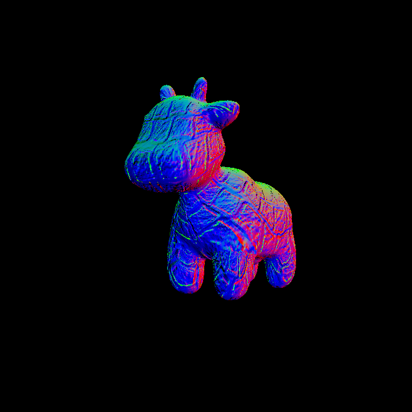
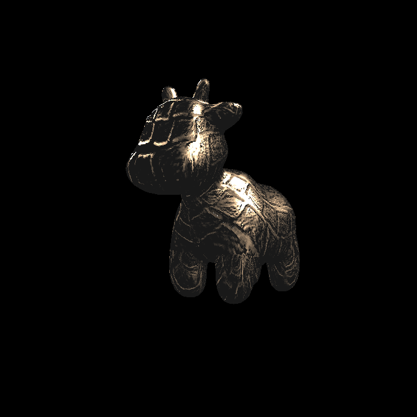
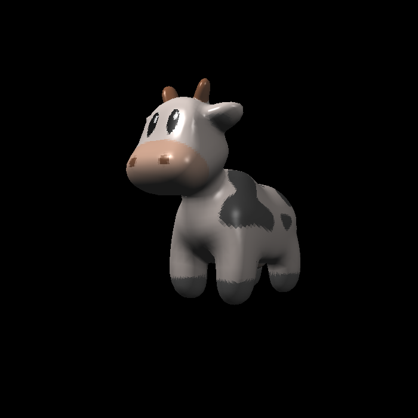

Implementation：

[5 marks] all file expected submitted with normal running behavior.

[10 marks] correctly implementation of interpolation on color, normal vector, texture coordinate and shading position (world space) and passing to fragment_shader_payload.

[20 marks] correctly implemented Blinn-Phong reflectance model.

(2 times ambient light)

[5 marks] correctly implemented Texture mapping with Blinn-Phong reflectance model

[5 marks] correctly implemented Bump mapping 

[using texture pic as normal texture]

[using hmap as normal texture]

[5 marks] correctly implemented Displacement mapping

[Bonus 5 marks] correctly implemented getColorBilinear defined in Texture class and used in texture_fragment_shader with test by low fidelity pic (300*300)

[300*300p without bilinear]

[300*300p with bilinear]

