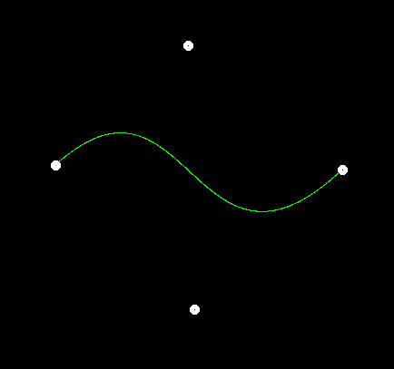
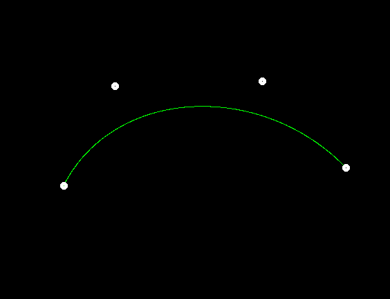
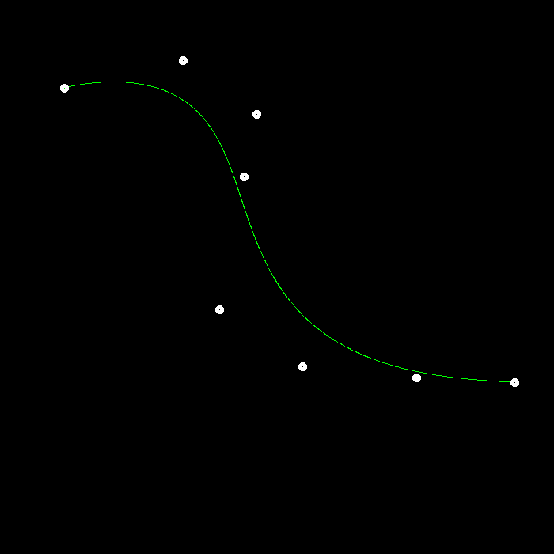
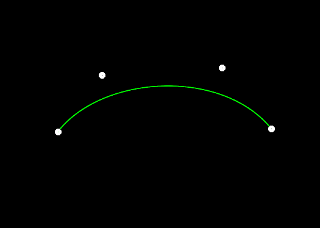
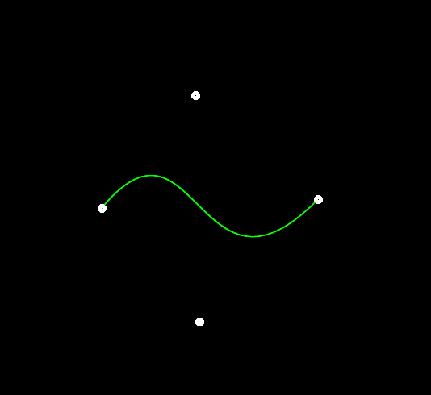
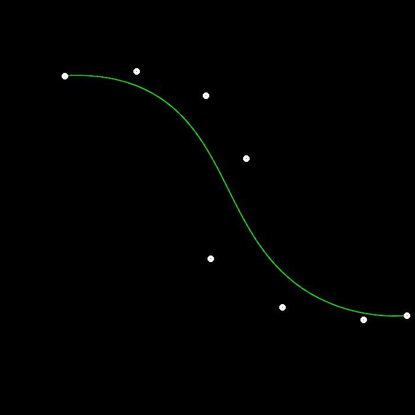

Implementation：

[5 marks] all file expected submitted with normal running behavior.

[20 marks] correctly implemented De Casteljau Algorithm.

[without anti-aliasing 1]

[without anti-aliasing 2]

[8 points without anti-aliasing]

[Bonus 5 marks] correctly implemented anti-aliasing

[with anti-aliasing 1]

[with anti-aliasing 2]

[8 points with anti-aliasing 2]

